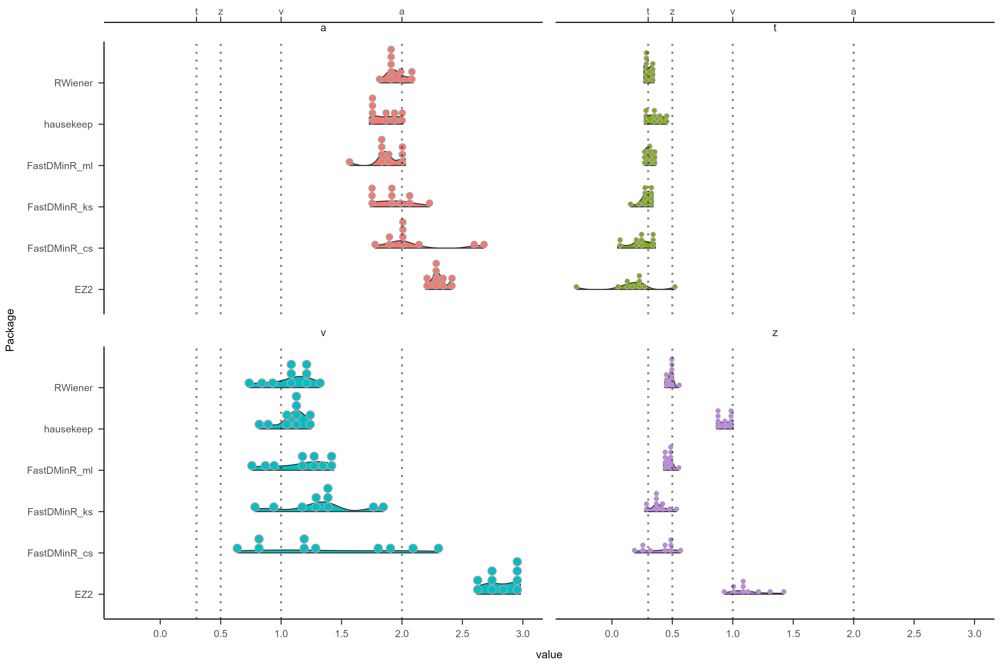
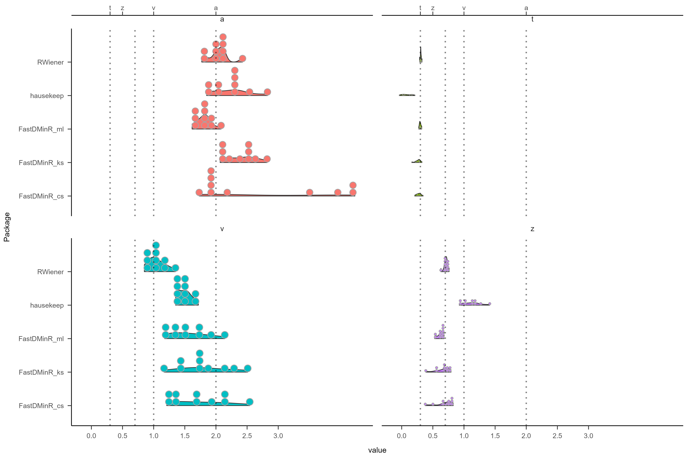
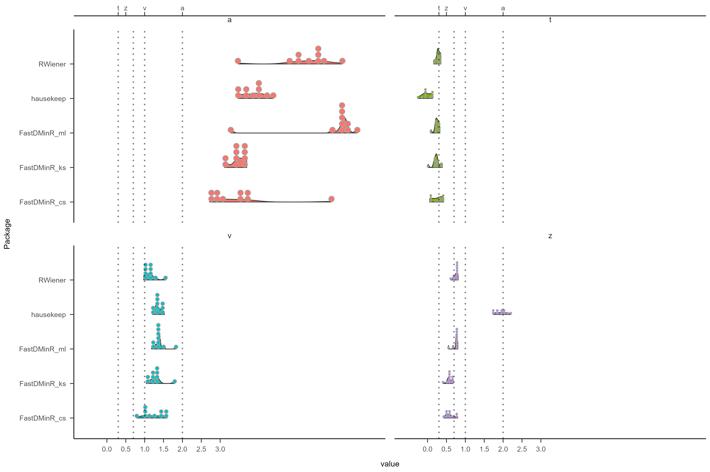
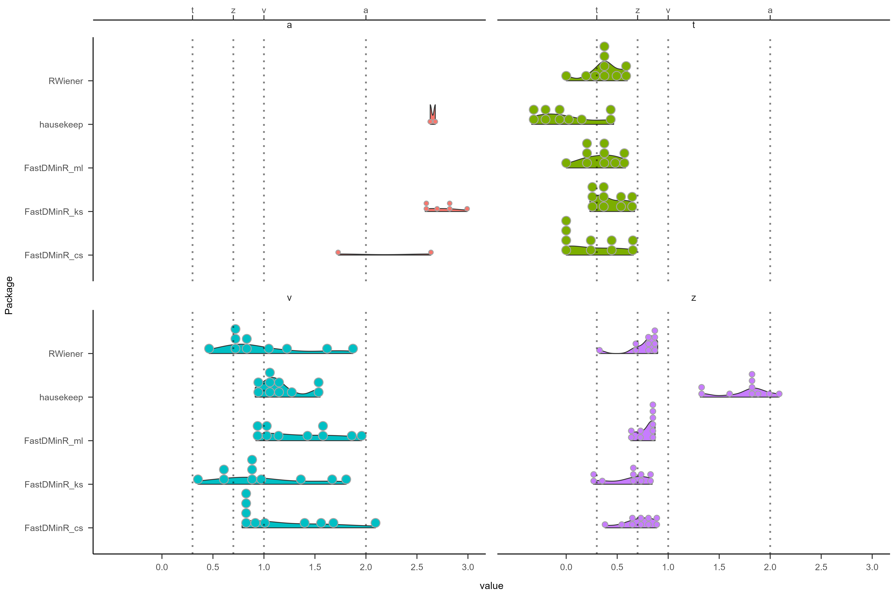

# Simulate Data, 
a: alpha = 2, 
t: tau = 0.3, 
z: beta = 0.7, 
v: delta = 1,


--------------------------------------------------------------------------------
################################################################################
--------------------------------------------------------------------------------


## 通过python得到hddm生成的模拟数据
```{python}
import hddm
import ssms
import pandas
import random
```

```{python}
# Choose some parameters
a = 2
t = 0.3
z = 0.7
v = 1

random.seed(20)

# Simulate Data
data = ssms.basic_simulators.simulator(model = 'ddm',
                                       theta = [v, a, z, t],
                                       n_samples = 30)
```

```{python}
df = dict(RT=[], choice=[])
for i in range(data['rts'].shape[0]):
    df['q'].append(data['rts'][i][0])
    df['resp'].append(data['choices'][i][0])
```

```{python}
df = pandas.DataFrame(df)
df.to_csv('data20.csv', index=False)
```


--------------------------------------------------------------------------------
################################################################################
--------------------------------------------------------------------------------


## 通过rwiener生成模拟数据
```{r}
library(tidyverse)
# EZ
library(hausekeep)
# install.packages("EZ2", repos="http://R-Forge.R-project.org")
library(EZ2)
# devtools::install_github("cran/RWiener")
library(RWiener)
# fast ddm
library(FastDMinR)
```

```{r, eval=FALSE}
set.seed(10)
simulate <- rwiener(n = 100, alpha = 2, tau = .3, beta = .7, delta = 1)
```

```{r}
# 如果是rwiener生成的，可以直接传入simulate，修改resp为upper和lower，就可以被RWiener识别
simulate <- read.csv("../DATA/data20.csv") %>%
  dplyr::mutate(resp = case_when(resp ==  1 ~  "upper",
                                 resp ==  -1 ~  "lower"),
  )

simulate_01 <- read.csv("../DATA/data20.csv") %>%
  dplyr::mutate(sub = 1,
                cnd = 1,
                resp = case_when(resp ==  1 ~  1,
                                 resp ==  -1 ~  0))
```


--------------------------------------------------------------------------------
################################################################################
--------------------------------------------------------------------------------


# 存放各种ddm包的结果
```{r}
res_ddm <- list()
#out_ddm <- list()
```

# RWiener
```{r RWiener}
temp <- wdm(simulate, yvar = c("q", "resp"))

result <- data.frame("RWiener", temp$coefficients[1], temp$coefficients[2], temp$coefficients[3], temp$coefficients[4])
colnames(result) <- c("Package", "a", "t", "z", "v")
rownames(result) <- NULL

res_ddm[[1]] <- result
names(res_ddm)[1] <- "RWiener"
rm(temp, result)
```

# FastDMinR
method = "ks"
```{r fast_dm}
temp <- FastDMinR::fast_dm(data = simulate_01,            
                           Subject = "sub",
                           Conditions = "cnd",
                           TIME = "q",
                           RESPONSE = "resp",
                           precision = 5.0,
                           method = "ks",
                           fix_to = list(p = 0, d = 0, sv = 0, st0 = 0, szr = 0),
                           depend_on_condition = list(a = "cnd"),
                           invariant = c("zr", "v", "t0"))
result <- data.frame("FastDMinR_ks", temp$indiv_estimates[3], temp$indiv_estimates[5], temp$indiv_estimates[2], temp$indiv_estimates[4])
colnames(result) <- c("Package", "a", "t", "z", "v")

res_ddm[[2]] <- result
names(res_ddm)[2] <- "fast_dm, method = ks"
rm(temp, result)
```

method = "ml"
```{r fast-dm}
temp <- FastDMinR::fast_dm(data = simulate_01,            
                           Subject = "sub",
                           Conditions = "cnd",
                           TIME = "q",
                           RESPONSE = "resp",
                           precision = 5.0,
                           method = "ml",
                           fix_to = list(p = 0, d = 0, sv = 0, st0 = 0, szr = 0),
                           depend_on_condition = list(a = "cnd"),
                           invariant = c("zr", "v", "t0"))
result <- data.frame("FastDMinR_ml", temp$indiv_estimates[3], temp$indiv_estimates[5], temp$indiv_estimates[2], temp$indiv_estimates[4])
colnames(result) <- c("Package", "a", "t", "z", "v")

res_ddm[[3]] <- result
names(res_ddm)[3] <- "fast_dm, method = ml"
rm(temp, result)
```

method = "cs"
```{r fast-dm}
temp <- FastDMinR::fast_dm(data = simulate_01,            
                           Subject = "sub",
                           Conditions = "cnd",
                           TIME = "q",
                           RESPONSE = "resp",
                           precision = 5.0,
                           method = "cs",
                           fix_to = list(p = 0, d = 0, sv = 0, st0 = 0, szr = 0),
                           depend_on_condition = list(a = "cnd"),
                           invariant = c("zr", "v", "t0"))
result <- data.frame("FastDMinR_cs", temp$indiv_estimates[3], temp$indiv_estimates[5], temp$indiv_estimates[2], temp$indiv_estimates[4])
colnames(result) <- c("Package", "a", "t", "z", "v")

res_ddm[[4]] <- result
names(res_ddm)[4] <- "fast_dm, method = cs"
rm(temp, result)
```

# EZ hausekeep::fit_ezddm
```{r}
temp <- hausekeep::fit_ezddm(data = simulate_01, rts = "q", responses = "resp") %>%
  dplyr::mutate(z = a / 2,
                Package = "hausekeep",
                t = t0_Ter) %>%
  dplyr::select(Package, a, t, z, v)

res_ddm[[5]] <- temp
names(res_ddm)[5] <- "hausekeep::fit_ezddm"
rm(temp)
```

# EZ2
```{r}
temp <- simulate_01 %>%
  dplyr::summarise(vrt0 = sd(q[resp == 0]), # ACC = 0 sd(RT_sec)
                   pe0 = mean(resp), 
                   vrt1 = sd(q[resp == 1]), # ACC = 1 sd(RT_sec)
                   pe1 = 1 - mean(resp)
                   ) %>%
  dplyr::ungroup() %>%
  dplyr::mutate(vrt0 = ifelse(is.na(vrt0), vrt1, vrt0)) %>%
  dplyr::select(vrt0, pe0, vrt1, pe1)

result <- EZ2::EZ2batch(c(v = 1, z = 0.5, a = 2, Ter = 0.3), 
              vrt0 ~ EZ2.vrt(v,z,a), 
              pe0 ~ EZ2.pe(v,z,a), 
              vrt1 ~ EZ2.vrt(v,a-z,a), 
              pe1 ~ EZ2.pe(v, a-z, a),
              data = temp) %>%
  data.frame(.) %>%
  dplyr::mutate(Package = "EZ2") %>%
  dplyr::select(Package,
                v = par.v,
                z = par.z,
                a = par.a,
                t = par.Ter)

res_ddm[[6]] <- result
names(res_ddm)[6] <- "EZ2"
rm(temp, result)
```

```{r}
out_ddm[[10]] <- do.call(rbind, res_ddm) 
names(out_ddm)[10] <- "10"
```


--------------------------------------------------------------------------------
################################################################################
--------------------------------------------------------------------------------


# 画图代码
## hausekeep和其他包的结果有数量级上的差异，故修正一下
```{r}
plot <- do.call(rbind, Map(cbind, round = names(out_ddm), out_ddm)) %>%
  dplyr::mutate(
    a = ifelse(Package == "hausekeep", a * 10, a),
    z = ifelse(Package == "hausekeep", z * 10, z),
    v = ifelse(Package == "hausekeep", v * 10, v),
    v = ifelse(Package == "EZ2", v * 10, v)
  ) %>%
  tidyr::pivot_longer(cols = c(a, t, z, v), names_to = "indice", values_to = "value") %>%
  # EZ2的结果过于糟糕，因此舍弃
  dplyr::filter(Package != "EZ2")
rownames(plot) <- NULL
```

```{r}
ggplot2::ggplot(aes(x = Package, y = value, fill = indice), data = plot) +
  see::geom_violinhalf() + # nolint
  ggdist::stat_dots() +
  ggplot2::coord_flip() +
  ggplot2::scale_y_continuous(limits = c(-0.5, 3),
                     sec.axis = sec_axis(~., breaks = c(0.3, 0.7, 1, 2),
                                             labels = c("t", "z", "v", "a")), # nolint
                                breaks = seq(0, 3, by = 0.5)
                                ) +
  ggplot2::geom_hline(yintercept = 0.3, linetype = "dotted", color = "black", size = 1, alpha = 0.5) + # nolint
  ggplot2::geom_hline(yintercept = 0.7, linetype = "dotted", color = "black", size = 1, alpha = 0.5) + # nolint
  ggplot2::geom_hline(yintercept = 1, linetype = "dotted", color = "black", size = 1, alpha = 0.5) + # nolint
  ggplot2::geom_hline(yintercept = 2, linetype = "dotted", color = "black", size = 1, alpha = 0.5) + # nolint
  papaja::theme_apa() +
  ggplot2::theme(legend.position = "none") +
  ggplot2::facet_wrap(~indice, ncol = 2) 
ggsave("packages_comparison4.png", width = 15, height = 10)
```


--------------------------------------------------------------------------------
################################################################################
--------------------------------------------------------------------------------


# 结果
## 出题人：RWiener, z: beta = 0.5, 100试次
a: alpha = 2, 
t: tau = 0.3, 
z: beta = 0.5, 
v: delta = 1,


1. EZ2会高估所有的参数，故在之后的测试中排除
2. hausekeep会高估z，因为它没有计算z的公式，而是z = a / 2
3. fast-dm当使用fs或cs方法时，得到的结果不太稳定，并不是每次都能得到正确答案
4. 在对a, t, v的估计上，RWiener, hausekeep和fast-dm_ml的结果相对最好

## 出题人：RWiener, z: beta = 0.7, 100试次
a: alpha = 2, 
t: tau = 0.3, 
z: beta = 0.7, 
v: delta = 1,


1. EZ2会高估所有的参数，在本次及之后测试中排除
2. hausekeep低估t，高估z
3. 可能由于RW是出题人，哪怕改变了z为0.7，依然可以很准确的估计v
4. fast-dm的三种方法，在改变了z的正确答案后，都出现了一定程度的对v的高估

## 出题人：HDDM, 100试次
a: alpha = 2, 
t: tau = 0.3, 
z: beta = 0.7, 
v: delta = 1,



1. 在HDDM出题后，所有R包对于a都有很大程度的高估
2. 对于t和z的估计，所有包都很稳定且准确。除了hausekeep低估t，高估z
3. 对于v的估计，RW依然是最稳定且最准确的，其他四个方法都会一定程度高估v

## 出题人：HDDM, 30试次
a: alpha = 2, 
t: tau = 0.3, 
z: beta = 0.7, 
v: delta = 1,



1. 试次的减少，会让所有R包对于a的高估更加严重
2. 对于t和z的估计，所有包都很稳定且准确。除了hausekeep低估t，高估z
3. 对于v的估计，在试次为30时，hausekeep反而是最稳定，且准确的估计方法，其他方法对v的估计都不太稳定


