### Forest Plot
```
plot_forest[[i]][[j]] <- ggplot2::ggplot(
    data = out[[i]][[j]], 
    mapping = aes(x = yi_r , y = reorder(Unique_ID, Order))
  ) +
  ggplot2::geom_linerange(aes(xmin = LLCI, xmax = ULCI), linewidth = 1.5) +
  ggplot2::geom_point(shape=15, size = 5) +
  ggplot2::scale_x_continuous(
    limits = c(-3.5, 3), 
    breaks = seq(-0.5,2.5, by = 0.5),
    sec.axis = sec_axis(
      ~., 
      breaks = c(-2.9, -1.2, 3),
      labels = c(
        "Author(s), 
        Year and Study", 
        "SMD (95%-CI)", 
        expression(italic(p) * "-value")
      )
    ),
  ) +
  ggplot2::geom_vline(
    xintercept = 0, linetype = "dotted", 
    color = "black", linewidth = 3, alpha = 0.5
  ) +
  ggplot2::geom_text(
    mapping = aes(x = -3.5, y = reorder(Unique_ID, Order), label = reorder(Unique_ID, Order)), 
    size = 7, hjust = 0, family='serif',
  ) + # Author_Year_Study
  ggplot2::geom_text(
    mapping = aes(x = -1.2, y = reorder(Unique_ID, Order), label = CI), 
    size = 7, hjust = 0.5, family='serif',
  ) + # CI
  ggplot2::geom_text(
    mapping = aes(x = 3, y = reorder(Unique_ID, Order), label = pval), 
    size = 7, hjust = 0.5, family='serif',
  ) + # Right: P-value
  ggplot2::labs(x = expression("Hedges' " * italic(g))) +
  ggplot2::ggtitle("(ij) <Indice> for [Self - <Target>]") +
  papaja::theme_apa() +
  ggplot2::theme(
    legend.position = "none",
    axis.text.x.top = element_text(size = 25, family='serif'),
    axis.text.x.bottom = element_text(size = 25, family='serif'),
    axis.title.x = element_text(size = 25, hjust = 0.66),
    plot.title = element_text(size = 30, family = 'serif', hjust = 0),
    legend.title = element_blank(),
    axis.line.y = element_blank(),
    axis.ticks.x.top = element_line(color = "transparent"), 
    axis.ticks.y= element_blank(),
    axis.text.y= element_blank(),
    axis.title.y= element_blank(),
  ) 

ggsave(filename = "./FIGURE/meta/Forest_<Target>_<Indice>.png", width = 24, height = 18, limitsize = FALSE)
```

<div style="display: flex; justify-content: space-around;">
  
  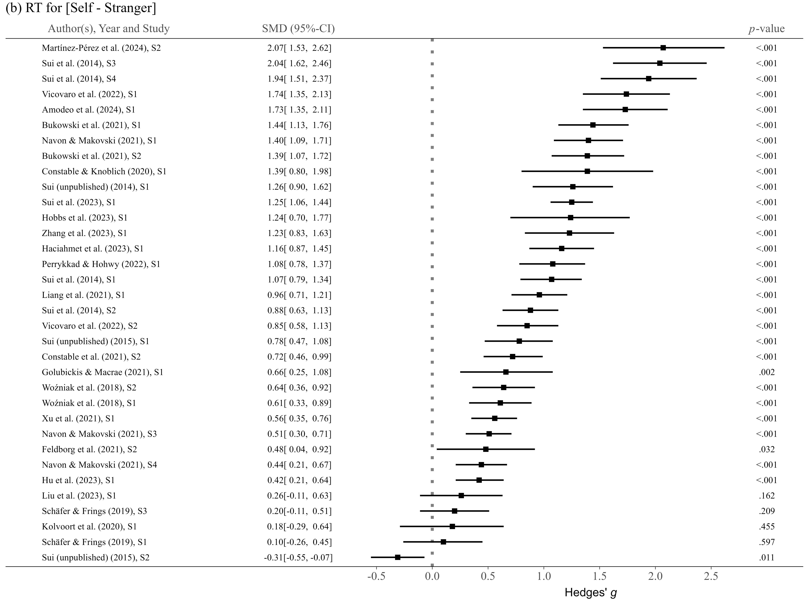
</div>

<br>

<div style="display: flex; justify-content: space-around;">
  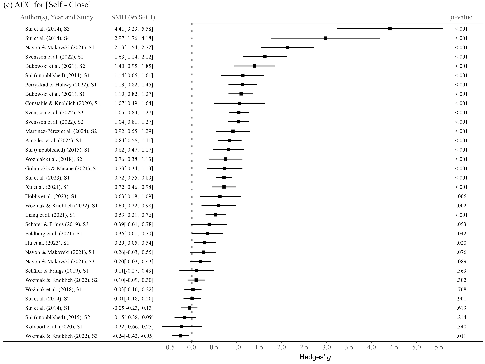
  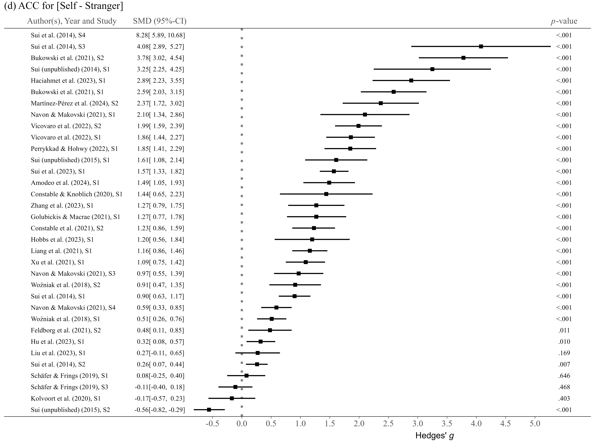
</div>

<br>

<div style="display: flex; justify-content: space-around;">
  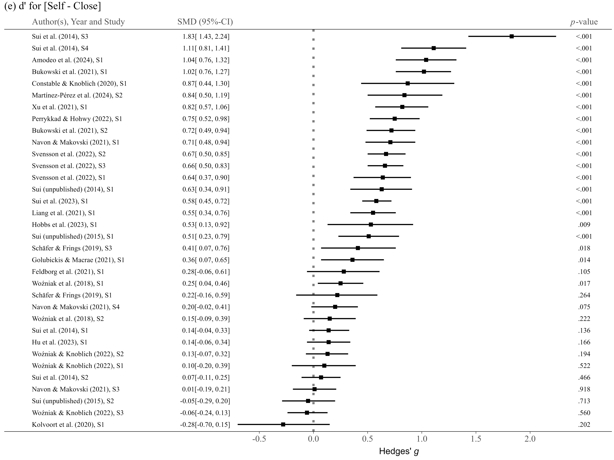
  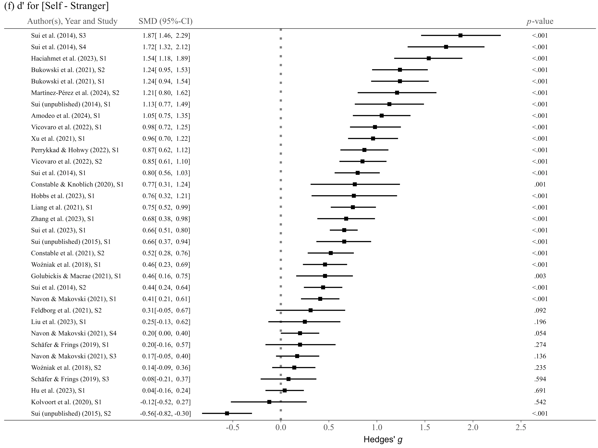
</div>

<br>

<div style="display: flex; justify-content: space-around;">
  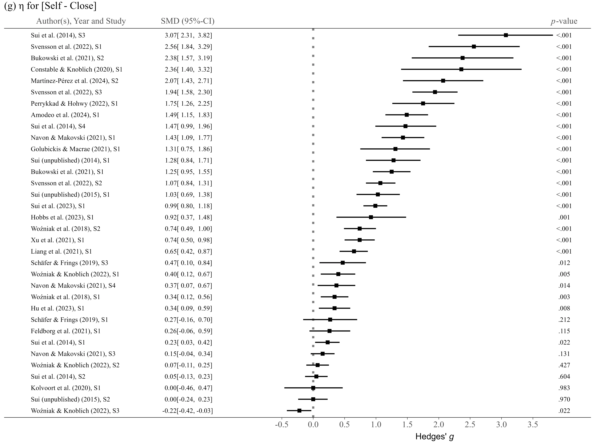
  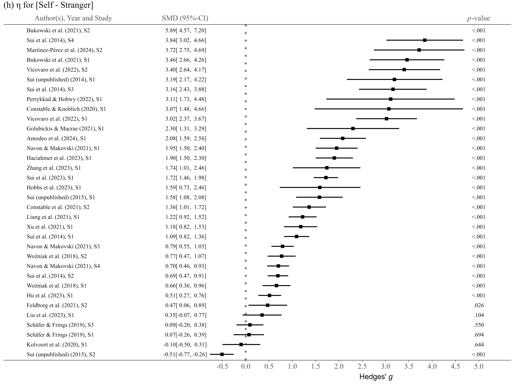
</div>

<br>

<div style="display: flex; justify-content: space-around;">
  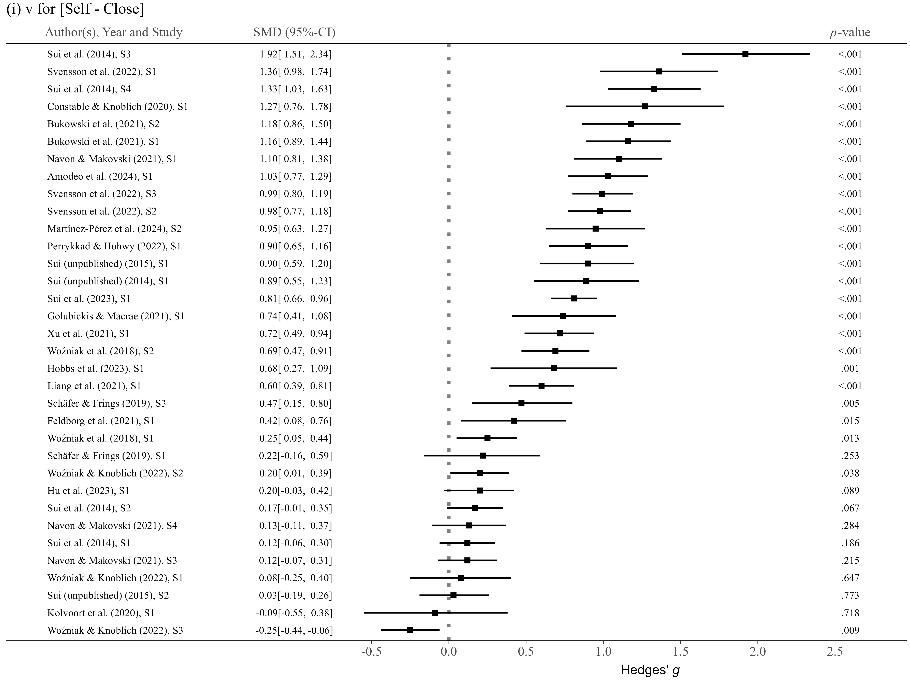
  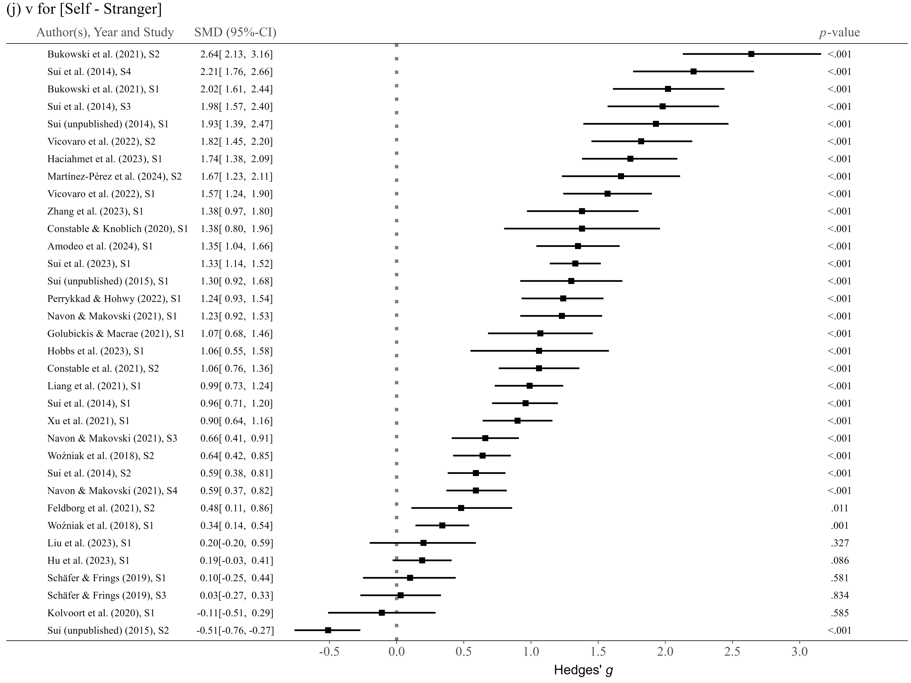
</div>

<br>

<div style="display: flex; justify-content: space-around;">
  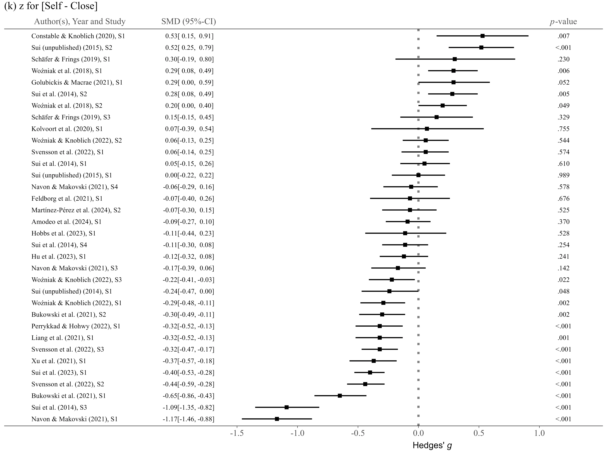
  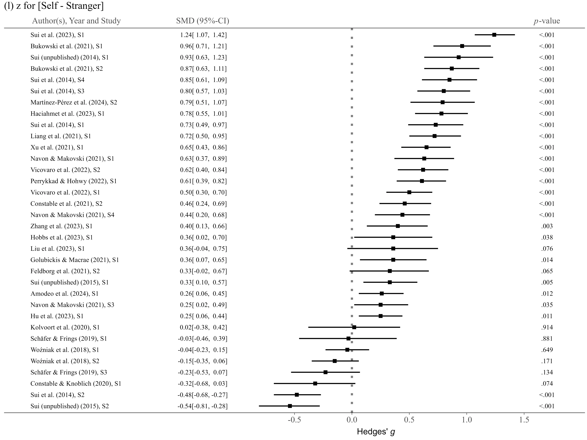
</div>